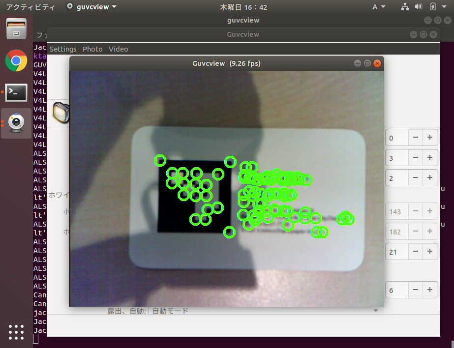

Title: JeVois Tutorial(2) - JeVoisでOpenCVのコーナー検出(C++)を実行
Date: 2020-01-09
Category: AI, 画像処理
Tags: エッジコンピューティング, 画像処理, JeVois
Slug: JeVois-Tutorial-2
Authors: Kousuke Takeuchi
Summary: サンプルコードではOpenCVが使用されていませんでしたが、jevois-sdkをインストールする際にOpenCV(4.0)パッケージも一緒にインストールされています。OpenCVの画像処理モジュールはそのまま使えますが、jevoisのモジュールから取得した画像をOpenCVで取り扱えるように変換する必要があることに注意しながら、コーナー検出のプログラムを書いていきます
Header_Cover: images/20200106_jevois-header.jpg
Og_Image: https://tech.wpaper-inc.com/images/20200106_JeVois_tg2e9bgo.jpg
Twitter_Image: https://tech.wpaper-inc.com/images/20200106_JeVois_tg2e9bgo.jpg

## 1. HelloJeVoisのサンプルプログラム

前回はC++の開発環境を構築しました。その後、カメラ画像に「Hello World」を表示するモジュールを実行しました。

モジュールのプログラム本体は`src/Modules/HelloJeVois/HelloJeVois.C`です。

```c++
 #include <jevois/Core/Module.H>
 #include <jevois/Image/RawImageOps.H>
 
 // icon by Catalin Fertu in cinema at flaticon
 
 //! JeVois sample module
 /*! This module is provided as an example of how to create a new standalone module.
 
     JeVois provides helper scripts and files to assist you in programming new modules, following two basic formats:
 
     - if you wish to only create a single module that will execute a specific function, or a collection of such modules
       where there is no shared code between the modules (i.e., each module does things that do not relate to the other
       modules), use the skeleton provided by this sample module. Here, all the code for the sample module is compiled
       into a single shared object (.so) file that is loaded by the JeVois engine when the corresponding video output
       format is selected by the host computer.
 
     - if you are planning to write a collection of modules with some shared algorithms among several of the modules, it
       is better to first create machine vision Components that implement the algorithms that are shared among several of
       your modules. You would then compile all your components into a first shared library (.so) file, and then compile
       each module into its own shared object (.so) file that depends on and automatically loads your shared library file
       when it is selected by the host computer. The jevoisbase library and collection of components and modules is an
       example for how to achieve that, where libjevoisbase.so contains code for Saliency, ObjectRecognition, etc
       components that are used in several modules, and each module's .so file contains only the code specific to that
       module.
 
     @author Sample Author
 
     @videomapping YUYV 640 480 28.5 YUYV 640 480 28.5 SampleVendor HelloJeVois
     @email sampleemail\@samplecompany.com
     @address 123 First Street, Los Angeles, CA 90012
     @copyright Copyright (C) 2017 by Sample Author
     @mainurl http://samplecompany.com
     @supporturl http://samplecompany.com/support
     @otherurl http://samplecompany.com/about
     @license GPL v3
     @distribution Unrestricted
     @restrictions None */
 class HelloJeVois : public jevois::Module
 {
   public:
     //! Default base class constructor ok
     using jevois::Module::Module;
 
     //! Virtual destructor for safe inheritance
     virtual ~HelloJeVois() { }
 
     //! Processing function
     virtual void process(jevois::InputFrame && inframe, jevois::OutputFrame && outframe) override
     {
       // Wait for next available camera image:
       jevois::RawImage const inimg = inframe.get(true);
 
       // We only support YUYV pixels in this example, any resolution:
       inimg.require("input", inimg.width, inimg.height, V4L2_PIX_FMT_YUYV);
       
       // Wait for an image from our gadget driver into which we will put our results:
       jevois::RawImage outimg = outframe.get();
 
       // Enforce that the input and output formats and image sizes match:
       outimg.require("output", inimg.width, inimg.height, inimg.fmt);
       
       // Just copy the pixel data over:
       memcpy(outimg.pixelsw<void>(), inimg.pixels<void>(), std::min(inimg.buf->length(), outimg.buf->length()));
 
       // Print a text message:
       jevois::rawimage::writeText(outimg, "Hello JeVois!", 100, 230, jevois::yuyv::White, jevois::rawimage::Font20x38);
 
       // Let camera know we are done processing the input image:
       inframe.done(); // NOTE: optional here, inframe destructor would call it anyway
 
       // Send the output image with our processing results to the host over USB:
       outframe.send(); // NOTE: optional here, outframe destructor would call it anyway
     }
 };
 
 // Allow the module to be loaded as a shared object (.so) file:
 JEVOIS_REGISTER_MODULE(HelloJeVois);
```

不要なコメントを省いて解説すると、プログラムの上から。。。

まずは、jevoisカメラからの画像取得や操作に必要なライブラリをインポートします。

```c++
 #include <jevois/Core/Module.H>
 #include <jevois/Image/RawImageOps.H>
```

続いて、動画像処理のためのクラスを定義します。定義したクラスを`JEVOIS_REGISTER_MODULE(<class_name\>)`でJeVoisで登録すると、カメラ画像をこのクラスで定義した関数で処理するようになります。

```c++
class HelloJeVois : public jevois::Module
{
# ... 関数の定義
}

JEVOIS_REGISTER_MODULE(HelloJeVois);
```

HelloJevoisクラスには、3つのpublic関数が定義されています。まずは共有コンストラクター/デコンストラクタです。この二つは特別なセットアップとシャットダウンをしない限りは使用することはなさそうです。

メインで記述するのが、`virtual void process`です。processには「`inframe`」と「`outframe`」が引数で指定されています。`inframe`には、JeVoisのファームが自動的に撮影した画像を指定してくれて、`outframe`には、自分で処理した画像を指定する必要があります。

```c++
virtual void process(jevois::InputFrame && inframe, jevois::OutputFrame && outframe) override {
  # ...ここに画像の処理内容を記述
}
```

続いて、主に使用するクラスモジュールですが、ここでは`jevois::InputFrame`, ``jevois::InputFrame`, `jevois::RawImage`と`jevois::rawimage`モジュールになります。

`InputFrame/OutputFrame`は、カメラから動画を取得したり、USB経由で配信する動画を設定するモジュールです。デバイスと画像データの橋渡しをするだけです。

主に操作するのが`jevois::RawImage`で、InputFrameから取得した画像データになります。OpenCVにおける`cv::Mat`クラスのようなもので、画像のピクセルデータと、画像のサイズやチャンネルデータを格納するクラスになります。

そして、画像に文字を描画したり操作するモジュールが、`jevois::rawimage`モジュールになります。いろいろ操作関数が定義されています。

```c++
jevois::RawImage const inimg = inframe.get(true);
inimg.require("input", inimg.width, inimg.height, V4L2_PIX_FMT_YUYV);

jevois::RawImage outimg = outframe.get();
outimg.require("output", inimg.width, inimg.height, inimg.fmt);
```

まずは、[`InputFrame::get()`](http://jevois.org/doc/classjevois_1_1InputFrame.html#a3300ed6b18c5b5488cf062a5b45c3b56)でカメラ画像を取得します。取得した画像は`RawImage`クラスとして返されます。続いて[`RawImage::require()`](http://jevois.org/doc/classjevois_1_1RawImage.html#aacde26c84586c08d1e913694670d2d8e)を呼び出していますが、JeVoisはvideomappingでモジュールに関係なくカメラ画像の解像度やピクセルフォーマットを変更することができるので、モジュール側で制限が必要な場合はrequire関数で制限を設定します。今回は解像度は何でもいいので、inimgのサイズをそのまま使っています。また、ピクセルフォーマットは`YUYV`を指定します。

`OutputFrame`でも同様に、出力する画像を取得します。ここで、取得しているのは画像配列へのポインタであって、配列にはまだ画像データが設定されていないことに注意してください。このポインタに対して画像を設定することで、USB経由で処理画像が送信されます。

さらに、`outimg.require`では、ピクセルフォーマットを`inimg.fmt`に設定しています。入力画像と同じYUYVになるように画像処理をしないといけないです。


続いて、出力画像に処理を加えていきます。

```c++
memcpy(outimg.pixelsw<void>(), inimg.pixels<void>(), std::min(inimg.buf->length(), outimg.buf->length()));
 
jevois::rawimage::writeText(outimg, "Hello JeVois!", 100, 230, jevois::yuyv::White, jevois::rawimage::Font20x38);
```

まずはmemcopyで、`inimg`の画像データをそのまま出力画像`outimg`に設定します。

その後、`rawimage::writeText`で、`outimg`に文字を描画します。引数の詳細は[こちら](http://jevois.org/doc/group__image.html#ga893e982b449643c8853afe424fb72c09)にありますが、やっていることは描画する座標とフォント、色の設定くらいです。OpenCVほど高機能にはなっていないみたいです。

最後に、`inframe.done()`と`outframe.send()`を呼び出します。

```c++
inframe.done(); // NOTE: optional here, inframe destructor would call it anyway
outframe.send();
```

[`InputFrame::done()`](http://jevois.org/doc/classjevois_1_1InputFrame.html#a3ad6ba7b0e66fefb8e43944ca4e90bcf)は、カメラ画像のフレーム取得を終了する関数ですが、ドキュメントには`InputFrame::get()`を呼び出したらすぐにdoneを実行してくれと書いてあります。ただし、コメントにもある通り、呼び出さなくてもデコンストラクタで必ず実行されるらしいです。InFrame::getをしたらすぐにdoneを呼び出すのが賢明そうです。

[`OutputFrame::send()`](http://jevois.org/doc/classjevois_1_1OutputFrame.html#ae6dafb6fab88b4166dc4b206c21c56a8)でUSB経由で処理画像データの送信を開始します。


## 2. OpenCVでコーナー検出

サンプルコードではOpenCVが使用されていませんでしたが、`jevois-sdk`をインストールする際にOpenCV(4.0)パッケージも一緒にインストールされています。

OpenCVの画像処理モジュールはそのまま使えますが、jevoisのモジュールから取得した画像をOpenCVで取り扱えるように変換する必要があることに注意しながら、コーナー検出のプログラムを書いていきます。

まずは、opencvのライブラリをインポートして、共通クラスを書いていきます。

```c++
#include <jevois/Core/Module.H>
#include <jevois/Image/RawImageOps.H>

#include <iostream>

using namespace cv;
using namespace std;

/*
    @author Whitepaper

    @videomapping YUYV 640 480 28.5 YUYV 640 480 28.5 SampleVendor HelloJeVois
    @copyright Copyright (C) 2020 by Whitepaper
    @distribution Unrestricted
    @restrictions None */

class HelloJeVois : public jevois::Module
{
  public:
    using jevois::Module::Module;
    virtual ~HelloJeVois() { }

virtual void process(jevois::InputFrame && inframe, jevois::OutputFrame && outframe) override
    {
      jevois::RawImage const inimg = inframe.get(true);
      inimg.require("input", inimg.width, inimg.height, V4L2_PIX_FMT_YUYV);
      
      jevois::RawImage outimg = outframe.get();
      outimg.require("output", inimg.width, inimg.height, inimg.fmt);
      
      # ... ここに検出ロジックを記述

      inframe.done();
      outframe.send();
    }
};

JEVOIS_REGISTER_MODULE(HelloJeVois);

```

続いて、jevoisのモジュールから取得した画像を`cv::Mat`に変換するためには、[`jevois::rawimage::convertToCvBGR()`](http://jevois.org/doc/namespacejevois_1_1rawimage.html)を使用します。グレースケールに変換して画像を取得するには、`jevois::rawimage::convertToCvGray()`を呼び出します。

OpenCVのコーナー検出は、グレースケールの画像を使用するため、以下のように書きます。

```c++
// グレースケールと標準化
Mat grayImg = jevois::rawimage::convertToCvGray(inimg);
normalize(grayImg, grayImg, 0, 255, NORM_MINMAX);
```

これで、`jevois::RawImage`を`cv::Mat`に変換できました。あとはOpenCVでコーナー検出を行います。

```c++
// コーナーの検出
vector<Point2f> corners;
goodFeaturesToTrack(grayImg, corners, 80, 0.01, 5);
vector<Point2f>::iterator it_corner = corners.begin();
for (; it_corner!=corners.end(); ++it_corner) {
    jevois::rawimage::drawCircle(outimg, it_corner->x, it_corner->y, 10, 2, jevois::yuyv::LightGreen);
}
```

`cv::goodFeaturesToTrack`でコーナーを検出し、corners配列に格納しています。最後に検出したコーナーをforループで取り出し、`outimg`に描画しています。描画は`jevois::RawImage`にするため、[`jevois::rawimage::drawCircle`](http://jevois.org/doc/group__image.html#gae7d102e1c456f87337d66a9a2fc11a58)関数を呼び出しています。


プログラムが書ければ、再度ビルドして実行します。

```shell
$ ./rebuild-platform.sh --live
$ guvcview
```

実行の結果、JeVoisでコーナー検出ができました。



