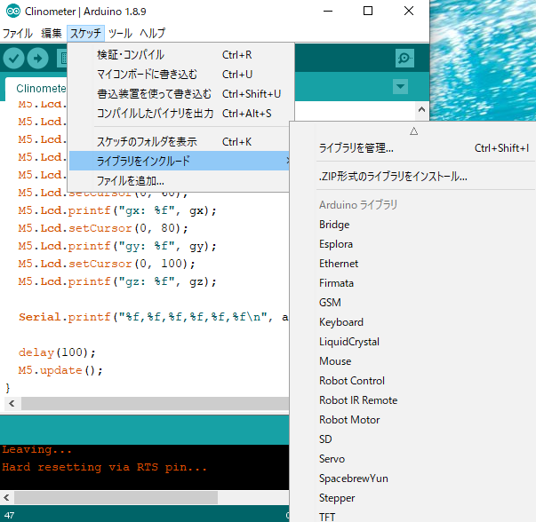
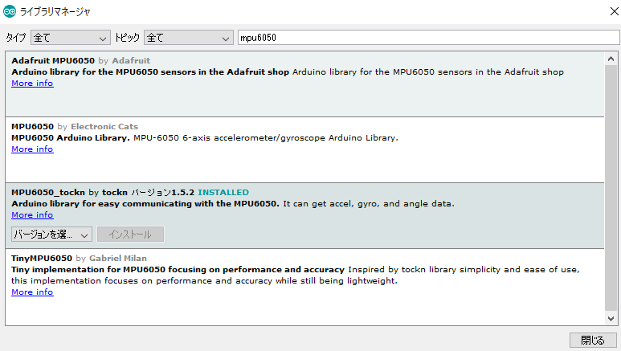
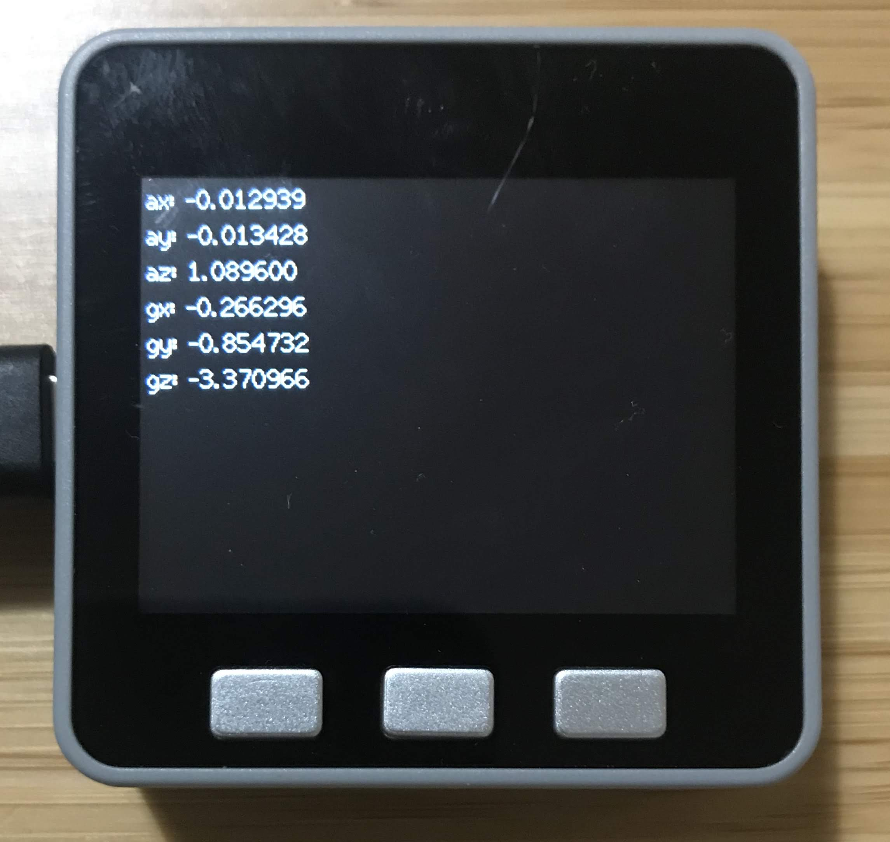
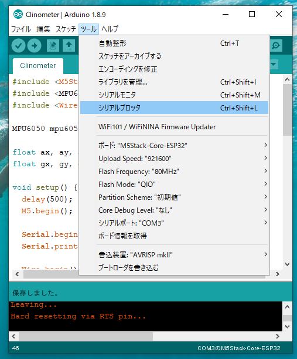
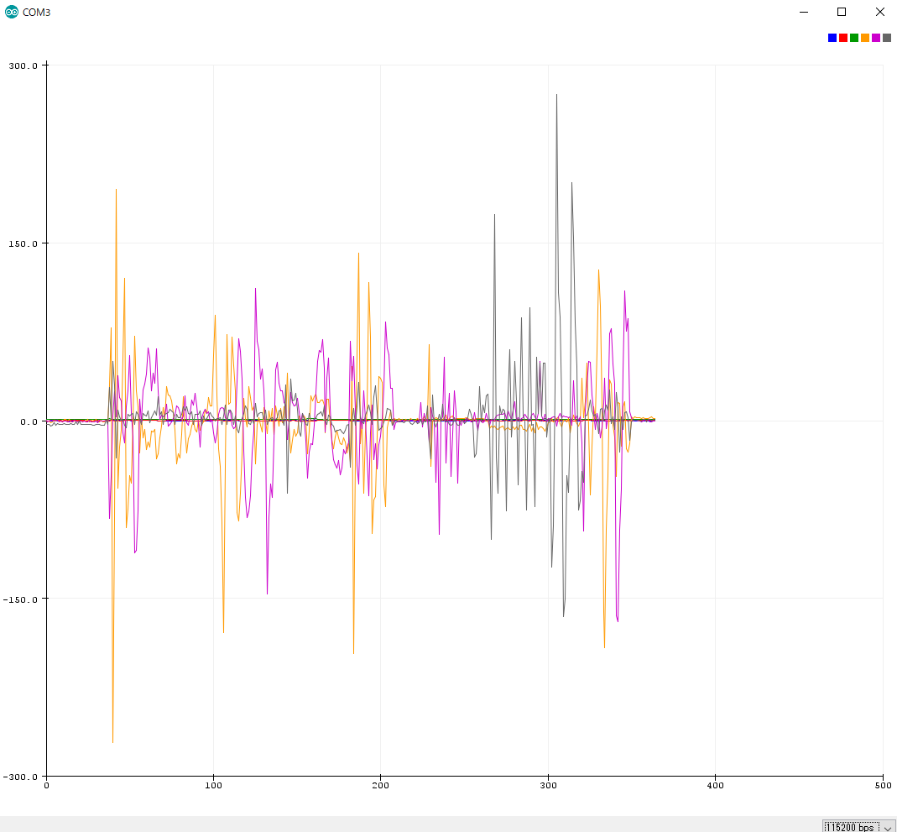

Title: M5Stackシリーズ(1) - M5Stack開発環境構築/6軸センサーデータの取得
Date: 2020-01-28
Category: ESP32
Tags: エッジコンピューティング, M5Stack, ESP32
Slug: M5Stack-Series-1
Authors: Kousuke Takeuchi
Summary: M5Stack Grayを購入しました。本記事のシリーズでは、M5Stackの開発環境構築から、センサーを使った姿勢推定、そしてJeVoisでの顔検知と連携したサーボの制御まで解説していこうと思います。
Header_Cover: images/20200128_m5-header.jpg
Og_Image: images/20200128_m5-header.jpg
Twitter_Image: images/20200128_m5-header.jpg

### シリーズ

1. [(本記事) M5Stack開発環境構築/6軸センサーデータの取得](M5Stack-Series-1.html)
3. 回転行列/クオータニオンの基礎
4. 静止状態でのカルマンフィルター/相補フィルターによるドリフト補正と姿勢推定
5. 動作状態でのドリフト補正と姿勢推定
6. 9軸センサーでの姿勢推定
7. サーボドライバーシールドとの連携
8. JeVoisの顔検知と追跡

[M5Stack Gray](https://www.switch-science.com/catalog/3648/)を購入しました。こちらには**MPU-9250 ９軸センサモジュール**が載っていて、通常3軸や6軸センサーでは3軸の角速度や角加速度を取得して初期位置からの移動を検出できます。また、別売りのシールドを搭載することで、サーボやモーターなどの外部デバイスの制御もArduinoと同様に簡単にできる端末となっています。本記事のシリーズでは、M5Stackの開発環境構築から、センサーを使った姿勢推定、そしてJeVoisでの顔検知と連携したサーボの制御まで解説していこうと思います。


## 1. Arduino IDEのセットアップ

セットアップ方法はこちらを参考にしました。

[M5Core Quick Start - Arduino Windows](https://docs.m5stack.com/#/en/quick_start/m5core/m5stack_core_get_started_Arduino_Windows)

英語の記事ですが、特段難しい箇所はありませんでした。不安な方はこちらなどを参考にしてください

[初心者向けM5Stackの始め方（ArduinoIDE編）](https://www.google.com/search?q=m5stack+arduino&oq=m5stack+arduino&aqs=chrome..69i57.4730j0j7&sourceid=chrome&ie=UTF-8)


合わせて、MPU6050からデータを取得するためのライブラリをインストールします

「スケッチ」＞「ライブラリをインクルード」＞「ライブラリを管理」



キーワードにmpu6050と入力すると、MPU6050_tocknという名前のライブラリがあるので、こちらをインストールします



以上で初期設定は完了です

## 2. MPU6050から加速度・角加速度を取得する

MPU6050からデータを取得し、M5Stackからシリアル経由でデータを送信するプログラムを作成しました。

```c++
#include <M5Stack.h>
#include <MPU6050_tockn.h>
#include <Wire.h>

MPU6050 mpu6050(Wire);

float ax, ay, az;
float gx, gy, gz;

void setup() {
  delay(500);
  M5.begin();

  Serial.begin(115200);
  Serial.printf("ax,ay,az,gx,gy,gz\n");

  Wire.begin();
  Wire.setClock(400000UL); // I2C周波数を400kHzに設定
  
  mpu6050.begin();
  mpu6050.calcGyroOffsets(false);

  M5.Lcd.setTextFont(2);
  M5.Lcd.setTextColor(TFT_WHITE, TFT_BLACK);
  M5.Lcd.println("M5Stack Balance Mode start");
}

void loop() {
  mpu6050.update();

  ax = mpu6050.getAccX();
  ay = mpu6050.getAccY();
  az = mpu6050.getAccZ();
  gx = mpu6050.getGyroX();
  gy = mpu6050.getGyroY();
  gz = mpu6050.getGyroZ();
  
  M5.Lcd.clear();
  M5.Lcd.setCursor(0, 0);
  M5.Lcd.printf("ax: %f", ax);
  M5.Lcd.setCursor(0, 20);
  M5.Lcd.printf("ay: %f", ay);
  M5.Lcd.setCursor(0, 40);
  M5.Lcd.printf("az: %f", az);
  M5.Lcd.setCursor(0, 60);
  M5.Lcd.printf("gx: %f", gx);
  M5.Lcd.setCursor(0, 80);
  M5.Lcd.printf("gy: %f", gy);
  M5.Lcd.setCursor(0, 100);
  M5.Lcd.printf("gz: %f", gz);

  Serial.printf("%f,%f,%f,%f,%f,%f\n", ax,+ay,az,gx,gy,gz);
  
  delay(100);
  M5.update();
}
```

コンパイルして書き込んだ結果、画面に加速度・角加速度が表示され、シリアル経由でもデータが受信できました



## 3. シリアルプロッタで表示

加速度、角加速度はCSVのようにカンマ区切りでデータが送られてきます。このような形式のデータは、Arduino IDEに標準搭載されているシリアルプロッタを使うと簡単にグラフ表示できます。


シリアルプロッタは「ツール」＞「シリアルプロッタ」で起動します




M5Stackを繋いだ状態だと、自動的にグラフ表示がはじまります




いかがでしたでしょうか？MPU6050は一般で広く使用されている加速度・角加速度センサーですが、M5Stackを使うと簡単にセンサーデータの取得とグラフ表示が出来ました。しかしセンサーデータはノイズが含まれていて、このままデータを使用すると徐々に本来の姿勢からずれていく現象が発生します(ドリフト現象)

次回は、これら加速度・角加速度から角度を算出し、さらにドリフト現象を補正しながら現在の姿勢を推定する方法を、理論と実装の両面から解説していこうと思います。


参考サイト

- https://strawberry-linux.com/pub/AK8963.pdf
- https://www.fujiele.co.jp/semiconductor/ti/tecinfo/news201707140000/
- http://watako-lab.com/2019/02/28/3axis_gyro/
- https://lab.fujiele.co.jp/articles/3962/
- https://strawberry-linux.com/catalog/items?code=12250