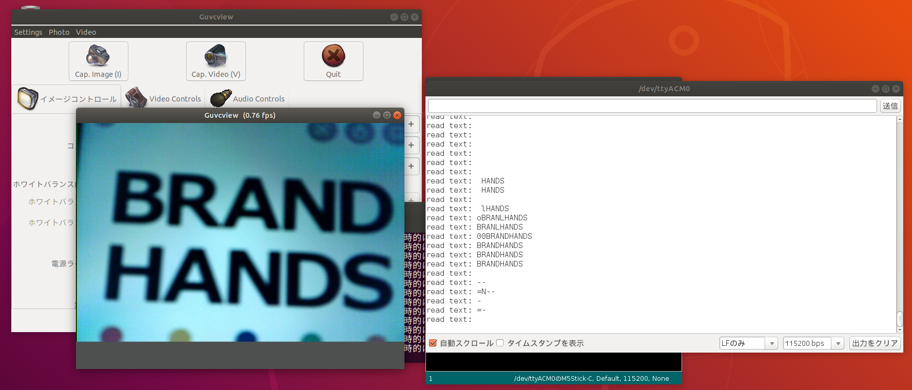

Title: JeVois Tutorial(4) USBシリアル経由のメッセージ送受信
Date: 2020-02-06
Category: AI, 画像処理
Tags: エッジコンピューティング, 画像処理, JeVois
Slug: JeVois-Tutorial-4
Authors: Kousuke Takeuchi
Summary: 
Header_Cover: images/20200206_UserConnectY.jpg
Og_Image: https://tech.wpaper-inc.com/images/20200206_UserConnectY.jpg
Twitter_Image: https://tech.wpaper-inc.com/images/20200206_UserConnectY.jpg

前回まで、C++やPythonを使ったOpenCVの様々なプログラムをJeVois上で動かす方法を紹介してきました。しかしOpenCVを動かすことは今やWindowsやMacOSなど、様々な環境で出来てしまいます。JeVoisが通常のホストマシンの環境と比較して、優れているところは大きく次の4つだと考えています

+ 同等のGPUが搭載されたPCと比較して非常に安価である
+ 小型かつ実行環境はSDカードにイメージを焼くだけで整えることができる
+ 似たような小型AI系デバイスは、MicroPythonやTensorflowLiteなど特殊なライブラリしかサポートしていないためホストマシンで開発したソフトウェアがそのまま使えないことが多いが、(機械学習にも対応している)OpenCV4のみを使ったプログラムであれば、ほぼそのままJeVoisでも動く。
+ Arduinoのように、簡単にシリアル経由でデータを送信できる。特殊なデバイスとの通信でない限り、USBレセプタクルさえあれば通信が可能

例えばRaspberry PiもPythonやC++の環境を作成することができ、OpenCVを動かすこともできます。しかし同じプログラムでもJeVoisと比較して計算がGPU最適化されていないため、ソフトウェアの実行速度はかなり遅くなります。

他にもMicroPythonを動かすことができるRISC-V搭載のAIカメラデバイスが特に中国で多く開発されていますが、これも特殊な環境のため、Tensorflowなどの学習済みモデルやOpenCVなどの使い慣れた画像処理ライブラリを使うことが難しくなります。

もちろんGPUを搭載してそれなりの画像処理が出来る小型デバイスとなると、1万円を切るようなものはJeVois以外に見ることはほぼないです。

以上の理由から、JeVoisは中小規模の業務レベルでは、低い開発コストと安い機材費でそれなりの効果を発揮してくれます。しかしこれまでの記事ではJeVois上で画像処理をしているだけで、処理した結果を別のプロセスで活用することが出来ませんでした。

今回の記事では、JeVoisで画像処理した結果を別のデバイスにUSBシリアル経由で送信する方法についてお伝えします。そこで前回の記事で紹介したTesseractOCRで読み取った文字データを、ホストマシンへ送信するプロジェクトを作成していきます。

## 1. TesseractOCRを修正する

TesseractはPythonで提供されているため、これまで紹介したC++のプロジェクトとは実装言語が異なります。しかし環境の構築方法や開発・デバイスでの実機動作についてはほぼ同じプロセスで行うことができます。

```python
import libjevois as jevois
import cv2
import numpy as np

class TesseractOCR:
    def __init__(self):
        self.ocr = cv2.text.OCRTesseract_create()
        
    def process(self, inframe, outframe):
        img = inframe.getCvBGR()
        txt = cv2.text_OCRTesseract.run(self.ocr, img, 50)
        msgbox = np.zeros((60, img.shape[1], 3), dtype = np.uint8) + 80
        cv2.putText(msgbox, txt, (3, 40), cv2.FONT_HERSHEY_SIMPLEX,
          0.8, (255,255,255), 2, cv2.LINE_AA)
        out = np.vstack((img, msgbox))

        # [追加] 読み取った文字をUSBシリアル経由で送信する
        jevois.sendSerial('read text: {}'.format(txt))
        
        outframe.sendCv(out)
```

これを`./rebuild-platform --live`でJeVoisに転送したら、次に`jevois-cmd`を使ってUSB経由でメッセージを送信するように設定します。[参考](http://jevois.org/tutorials/UserParseSerial.html)

```shell
$ jevois-cmd setpar serout USB
$ jevois-cmd setpar serstyle Normal
```

コマンドについては、後ほど解説します。

guvcviewで処理画像を確認しながら、Arduino IDEのシリアルモニタで受信メッセージを確認します。

```shell
$ guvcview -d /dev/video0
```

シリアルモニタでは、シリアルポートを`/dev/ttyACM0`、ボートレートを`115200`に設定します。

guvcviewでカメラ画像を確認し、シリアルモニタにOCRで読みだしたテキストが送信されていることが確認できます。



## 2. JeVoisにおけるUSBシリアル通信の基礎

公式には[こちら](http://jevois.org/doc/UserConnect.html)に情報が掲載されています。

まずJeVoisには2種類の通信方法があります。

- USB 2.0の5ピンコネクタ。電源供給用とホストマシンへの動画送信に使用されます
- 4ピン JST-SH 1.0ミリコネクタ。Arduinoなどと通信するように、TTLレベルのUARTを使った通信に使用されます

より詳細なことは公式サイトを確認してもらいたいのですが、JeVoisからはUSBを使った通信と4ピンケーブルを使った通信方法があります。

**USB**


USBケーブルの端子には、ミニUSBポートとオスポート２つがあります。ミニUSBポートはJeVois本体にとりつけ、残りのうちケーブルが二股になっている方をホストマシンに、一股になっている方を外部電源に接続します

**4ピンコネクタ**


4ピンコネクタについては、今回の記事では扱いません。[公式ページ](http://jevois.org/doc/UserSerial.html)を確認してください。

## 3. シリアル通信のタイプ

シリアル通信には、「**serlog**」と「**serout**」があります。serlogはデバッグメッセージを送信するため、seroutはArduinoやホストマシンなど外部デバイスにメッセージを送信するために使用されます。

本来は4ピンコネクタからseroutでメッセージを送り、USBシリアルからserlogを送信しますが、これは自由に入れ替えることが出来ます。

 詳細なドキュメントは、[Command-line interface user guide](http://jevois.org/doc/UserCli.html)に掲載されています。

## 4. USB経由で動画を送るのをやめ、メッセージのみを送信

[under written]

