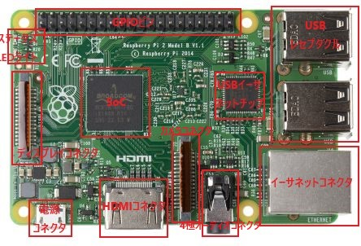

Title: Raspberry Piで学ぶコンピュータアーキテクチャ解説(1) - コンピュータの仕組み
Date: 2020-01-14
Category: Raspberry Pi
Tags: コンピュータアーキテクチャ, Raspberry Pi
Slug: RaspberryPi-ComputerArchitecture-1
Authors: Kousuke Takeuchi
Summary: summary
Header_Cover: images/20200116_raspi_computer_architecture_1-header
Og_Image: https://tech.wpaper-inc.com/images/20200116_raspi_computer_architecture_1-header
Twitter_Image: https://tech.wpaper-inc.com/images/20200116_raspi_computer_architecture_1-header
Status: draft

1,2章をまとめた

## Raspberry Piについて

### 用語

+ **SoC** (System on a Chip) - すぐ利用できる機能を満載した小さなパッケージ。Raspberry PiにはCPU/GPU/デジタル信号回路/アナログ信号回路/ハイブリッド信号回路が含まれる
+ **CPU** (Central Process Unit) - OSの制御でデータ処理を実行する
+ **GPU** (Graphical Process Unit) - OSのデスクトップを提供

### Raspberry Piの歴史

+ イギリスの登録チャリティで始まった (イギリスでは非営利事業を登録チャリティの認定を受けることで税制適用を受ける)
+ 2009年 ケンブリッジのコンピュータサイエンスの学習を推進するという目的で始まった。当時コンピュータサイエンスとプログラミングの研究所への出願者数やスキルが低下していたため。
+ 2012年 Raspberry Pi Model B発売
+ 2014年 200万台を売り上げる
+ 2015年 Raspberry Pi 2 Model B, 4コアARMプロセッサを搭載し、メモリを増設した
+ 2016年 Raspberry Pi 3 Model B, 1.2GHz 64ビットの4コアARMv8 CPUと1GBのRAM, 無線とBluetoothを搭載

### Raspberry Piの特徴

+ 組み込みLinuxの世界への参入障壁を下げるために開発された

+ SoCによって、ボード上の回路の複雑さが劇的に低下し、パッケージの大幅な小型化 - Broadcom提供
+ Raspberry Pi **1ではBroadcom *BCM2835*(シングルコア)**, **2では*BCM2836*(クアッドコア)**, **3では*BCM2837*(クアッドコア)**が搭載されている
+ GPIOであらゆるデバイスを制御。マウスなどの周辺機器はUSBレセプタクルを通じて接続
+ 有線LANでインターネットに接続
+ 3.5ミリのオーディオ入出力。コンポジットビデオへの出力もできる
+ CSIコネクタから、**5Mピクセルの静止画像と1080HDの映像**が取り込める
+ HDMIでGUI出力も可能。GPUによって制御される
+ Micro-USB電源レセプタクルで電源を供給
+ microSDからOSをブートする。**32GBが推奨されている**。
+ DSIディスプレイコネクタから、LCDの液晶ディスプレイ画面を駆動する

#### ステータスLEDライト

+ ACT (activity) : 緑 - SDメモリカードが挿入されて、アクセス可能である
+ PWR (power) : 赤 - 通電している
+ FDX (full duplex) : 緑 - LANに接続している
+ LNK (link) : 緑の点滅 - LANでアクティビティが発生している

## コンピュータが動く仕組み

